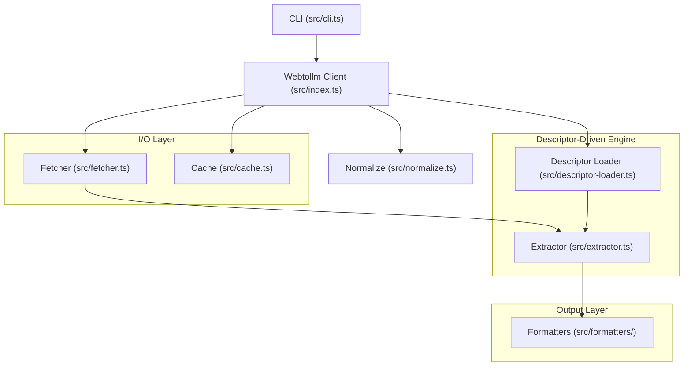

# webtollm — Implementation Spec

## Intent

Build a Node.js npm module that fetches web documentation pages (starting with Oracle error docs), extracts structured content using a generic descriptor-driven cheerio engine, and returns it in token-efficient formats (TOON, Markdown, JSON) suitable for LLM context injection. The module ships with two bundled descriptors (`oracle-error-docs`, `oracle-standard-docs`) and supports user-provided descriptors for any site. v1 targets ORA error prefix convenience wrappers with the generic extraction engine underneath.

## Decisions & Notes

| Decision | Choice | Rationale | Source |
|----------|--------|-----------|--------|
| Output format default | TOON | 17% smaller than JSON on batch, self-describing, general-purpose | Design summary |
| Secondary formats | Markdown + JSON | Markdown for human-readable, JSON for programmatic | Design summary |
| Extraction approach | Cheerio + descriptors | DOM is known/static. Descriptors decouple engine from sites. 10x lighter than JSDOM | Design summary + dom-descriptor-spec.md |
| JS rendering | Not needed | Oracle docs are static HTML | Design summary |
| Version handling | Latest release only (first visible `<div>`) | 90% use case. Multi-version deferred to v1.1 | Design summary |
| Error prefix scope | ORA only, extensible | Architecture uses `{prefix}-{code}` for future TNS/PLS/RMAN | Design summary |
| Caching | Pluggable interface, filesystem default | `CacheProvider` interface. Default: gzip-compressed filesystem. Can disable or replace | Design summary |
| Runtime | Node.js only | Avoids CORS. Browser deferred | Design summary |
| Module system | ESM (`"type": "module"`) | @toon-format/toon is ESM-only. Modern Node.js standard. Aligns with .mjs CLI | Spec writer — T3 resolution |
| Test framework | vitest | Modern standard for Node.js/TypeScript | Spec writer — T1 resolution |
| Build tooling | tsc | Straightforward TypeScript compilation | Spec writer — T2 resolution |
| Generic API surface | `extract(url, opts?)` public alongside Oracle convenience wrappers | Scope says "static worker: takes URL + descriptor". dom-descriptor-spec.md shows `new Webtollm({ descriptors: [...] })` | Spec writer — T6 resolution |
| Generic return type | `Record<string, unknown>` | Descriptor fields are dynamic. Oracle wrappers type-narrow to `OracleError` | Spec writer — T7 resolution |
| ms-system-error-codes.json | Not bundled in v1 | Exists in repo for validation. Scope: "Bundled descriptors: oracle-error-docs.json, oracle-standard-docs.json" | Spec writer — T8 resolution |
| `gpt-3-encoder` | devDependency only | Used by validation scripts, not production code | Spec writer — T4 resolution |

## Architecture



### File Structure

```
webtollm/
├── src/
│   ├── types.ts                 # All interfaces and type definitions
│   ├── errors.ts                # Custom error classes (6 classes)
│   ├── normalize.ts             # ORA code normalization
│   ├── descriptor-loader.ts     # Load bundled + user descriptors, match URL
│   ├── extractor.ts             # Generic descriptor-driven cheerio extraction
│   ├── fetcher.ts               # HTTP GET with retry/timeout/rate-limit
│   ├── cache.ts                 # CacheProvider, FilesystemCache, MemoryCache
│   ├── formatters/
│   │   ├── index.ts             # format() dispatcher
│   │   ├── toon.ts              # TOON formatter via @toon-format/toon
│   │   ├── markdown.ts          # Markdown formatter
│   │   └── json.ts              # JSON formatter
│   ├── index.ts                 # Webtollm client class + public exports
│   └── cli.ts                   # CLI entry point
├── src/__tests__/
│   ├── errors.test.ts
│   ├── normalize.test.ts
│   ├── descriptor-loader.test.ts
│   ├── extractor.test.ts
│   ├── fetcher.test.ts
│   ├── cache.test.ts
│   ├── formatters.test.ts
│   ├── index.test.ts
│   ├── warming.test.ts
│   └── cli.test.ts
├── test/
│   └── fixtures/
│       ├── ora-00001.html       # Decompressed from .validation-cache/
│       └── ora-12154.html       # Decompressed from .validation-cache/
├── descriptors/                 # Existing
│   ├── oracle-error-docs.json
│   ├── oracle-standard-docs.json
│   └── ms-system-error-codes.json  # Not bundled in v1 — validation reference
├── bin/
│   └── webtollm.mjs            # ESM shim: #!/usr/bin/env node → import dist/cli.js
├── dist/                        # tsc output (gitignored)
├── tsconfig.json
├── vitest.config.ts
└── package.json
```

## Config Schema

```typescript
// tsconfig.json
{
  "compilerOptions": {
    "target": "ES2022",
    "module": "NodeNext",
    "moduleResolution": "NodeNext",
    "outDir": "dist",
    "rootDir": "src",
    "declaration": true,
    "declarationMap": true,
    "sourceMap": true,
    "strict": true,
    "esModuleInterop": true,
    "skipLibCheck": true,
    "forceConsistentCasingInFileNames": true,
    "resolveJsonModule": true
  },
  "include": ["src"],
  "exclude": ["src/__tests__"]
}

// vitest.config.ts
import { defineConfig } from 'vitest/config';
export default defineConfig({
  test: {
    include: ['src/__tests__/**/*.test.ts'],
    globals: false,
  },
});

// package.json updates
{
  "type": "module",
  "main": "dist/index.js",
  "types": "dist/index.d.ts",
  "exports": {
    ".": {
      "types": "./dist/index.d.ts",
      "default": "./dist/index.js"
    }
  },
  "bin": {
    "webtollm": "./bin/webtollm.mjs"
  },
  "files": ["dist", "bin", "descriptors/oracle-error-docs.json", "descriptors/oracle-standard-docs.json"],
  "scripts": {
    "build": "tsc",
    "test": "vitest run",
    "test:watch": "vitest"
  },
  "dependencies": {
    "@toon-format/toon": "^2.1.0",
    "cheerio": "^1.2.0"
  },
  "devDependencies": {
    "@types/node": "^22.0.0",
    "gpt-3-encoder": "^1.1.4",
    "typescript": "^5.7.0",
    "vitest": "^3.1.0"
  }
}
```

### Runtime Config (WebtollmConfig)

```typescript
interface WebtollmConfig {
  cache?: false | CacheProvider;    // false=disabled, undefined=FilesystemCache default
  cacheTtl?: number;                // default: 86400000 (24h in ms)
  baseUrl?: string;                 // default: 'https://docs.oracle.com/en/error-help/db/'
  timeout?: number;                 // default: 10000 (10s in ms)
  descriptors?: Array<string | Descriptor>;  // user-provided descriptors (file paths or objects)
  debug?: boolean;                  // default: false — enable console debug logging
}
```

## Integration Discovery Findings

| System | Protocol | Auth | Status | Notes |
|--------|----------|------|--------|-------|
| Oracle error docs | HTTPS GET | None (public) | Verified | DOM verified on 8 real pages. Static HTML, no JS needed |
| Oracle error index | HTTPS GET | None (public) | Verified | ~3,500 ORA codes, single page, `<a href="ora-XXXXX/">` links |
| Oracle standard docs | HTTPS GET | None (public) | Verified | SQL Reference, product docs. Different DOM (`article > div.ind`) |
| @toon-format/toon | npm import | N/A | Installed | v2.1.0. `encode(input, options?)` → TOON string. ESM-only |
| cheerio | npm import | N/A | Installed | v1.2.0. `cheerio.load(html)` → jQuery-like API |

## Core Behavior

**Single error lookup (happy path):**

1. User calls `client.fetchError('ORA-00001')` or `client.extract(url)`
2. Normalize code: `ORA-00001` → `ora-00001` (for Oracle convenience path)
3. Construct URL: `https://docs.oracle.com/en/error-help/db/ora-00001/`
4. Check cache: `cache.get('ora-00001')`
5. Cache hit + fresh → return cached `OracleError`, apply formatter
6. Cache miss or stale → fetch HTML via `fetcher.get(url)`
7. Resolve descriptor: match URL against bundled + user descriptors
8. Extract: `extractor.extract(html, descriptor, url)` → structured object
9. Store in cache: `cache.set('ora-00001', result, ttl)`
10. Apply formatter: `formatters.format(result, options.format)` → string
11. Return formatted string (CLI) or structured object (API)

**Stale cache behavior:** Return stale data immediately, trigger background refresh (non-blocking). Never block the caller on a stale cache entry.

**Generic extraction path (`client.extract(url)`):**

1. Match URL against loaded descriptors (user-provided first, then bundled)
2. Fetch HTML
3. Extract using matched descriptor
4. Return `Record<string, unknown>` (no type narrowing — generic)

## Metrics/Outputs

| Metric | Type | Source | Notes |
|--------|------|--------|-------|
| Token reduction vs raw HTML | Percentage | Validation report | 97% for Oracle error docs (all formats) |
| TOON vs JSON savings | Percentage | Validation report | 17% on batch, ~4% on single |
| Cache gzip compression ratio | Percentage | Validation report | ~45% average |
| Extraction field coverage | Count (found/total) | Test fixtures | 8/8 required fields on Oracle errors |

## Error Handling

| Scenario | Error Class | Behavior | Recovery |
|----------|-------------|----------|----------|
| Invalid error code format | `InvalidCodeError` | Throw with expected pattern hint | Caller fixes input |
| HTTP 404 | `ErrorNotFoundError` | Throw with code and URL | Caller handles missing code |
| HTTP timeout | `FetchTimeoutError` | Throw after configured timeout | Caller retries or adjusts timeout |
| HTTP 429 (rate limited) | Retry internally | Exponential backoff, max 3 attempts | If still 429 after 3 → throw `NetworkError` |
| Network failure | `NetworkError` | Throw wrapping original error | Caller handles connectivity |
| DOM structure changed | `ExtractionError` | Throw "page structure may have changed" when required fields missing | Update descriptor |
| Index page fetch fails | `IndexFetchError` | Throw when `listErrors()` or `warmAll()` fails | Caller handles |
| Cache miss | Transparent | Fetch live, populate cache | Automatic |
| Cache stale (TTL expired) | Transparent | Return stale + background refresh | Automatic |
| Cache warm failure | Warning log | Keep existing cached entry, don't evict | Automatic |
| No descriptor matches URL | `ExtractionError` | Throw "no descriptor matches URL" | User provides descriptor |

All error classes extend a base `WebtollmError` class. Each carries `code` (string enum), `message`, and `cause` (original error when wrapping).

## Dependencies

| Package | Version | Purpose | Production |
|---------|---------|---------|------------|
| `cheerio` | ^1.2.0 (installed: 1.2.0) | DOM parsing + CSS selectors | Yes |
| `@toon-format/toon` | ^2.1.0 (installed: 2.1.0) | TOON format encoding | Yes |
| `typescript` | ^5.7.0 | TypeScript compilation | Dev |
| `vitest` | ^3.1.0 | Test framework | Dev |
| `@types/node` | ^22.0.0 | Node.js type definitions | Dev |
| `gpt-3-encoder` | ^1.1.4 (installed: 1.1.4) | Token counting (validation scripts only) | Dev |
| Native `fetch()` | Node.js built-in | HTTP requests | N/A (runtime) |
| Native `zlib` | Node.js built-in | gzip compression for cache | N/A (runtime) |

## Out of Scope

- Local knowledge DB (`.toon` curated database with RC/DIAG/FIX/HUNT enrichment) — Phase 2
- Knowledge DB update pipeline — Phase 2
- Non-ORA prefixes (TNS, PLS, RMAN, ACFS) — Phase 2
- MS Win32 system error codes bundled descriptor — Phase 2
- Python descriptor generator script — Phase 2
- Multi-version/release selection — v1.1
- Positional pipe-delimited format — Phase 3
- Browser/CORS support — Phase 3
- SQLite cache backend
- JS-rendered page support (Playwright)
- Crawling (follow links between pages)
- PDF extraction
- Authentication/cookies
- Embeddings or ML-based extraction
- Rate limiting configuration (hardcoded 100ms between batch requests)
- Proxy support
- Fallback Readability-style extraction for unknown URLs
- Community-contributed descriptor registry

## Testing Strategy

**Archetype:** Infrastructure Tool (HTTP client + DOM parser)

**What to test:**

| Category | What | How |
|----------|------|-----|
| Extractor accuracy | Given known HTML fixture → correct structured object | Fixture-based unit tests |
| All 7+ extraction types | text, list, heading_section, nested_sections, repeating_group, link_list, code_blocks | Per-type test cases on fixtures |
| Code normalization | ORA-1→ora-00001, ora00001→ora-00001, invalid→throw | Table-driven unit tests |
| Descriptor loading | Bundled discovery, user override, URL matching | Unit tests with mock descriptors |
| Formatters | OracleError → valid TOON/Markdown/JSON | Snapshot/assertion tests |
| Cache lifecycle | Write→read, gzip roundtrip, TTL expiry, cache bypass, clear | Filesystem tests in tmp dir |
| Fetcher retry | 429→backoff→retry, timeout, 404, network error | Mock global fetch |
| Client integration | Full path: normalize→cache check→fetch→extract→format→cache store | Mock fetcher, real extractor+fixtures |
| Cache warming | warm() re-fetches stale, warmAll() from index, concurrency | Mock fetcher |
| CLI arg parsing | --format, --no-cache, --list, --warm, --warm-all, positional codes | Programmatic CLI invocation |
| Error classes | Correct inheritance, properties, messages | Unit tests |

**What NOT to test:**

- Live HTTP requests to Oracle docs (use cached HTML fixtures)
- @toon-format/toon internal encoding correctness (trust the library)
- cheerio parsing correctness (trust the library)
- gzip compression correctness (trust Node.js zlib)
- TypeScript type checking at runtime (trust the compiler)

**Mock boundaries:**

| Boundary | Mock | Real |
|----------|------|------|
| HTTP responses | Mock global `fetch` with fixture HTML | Never in unit tests |
| Filesystem cache | Real filesystem in `os.tmpdir()` test dirs | Always real |
| cheerio | Never mock | Always real |
| @toon-format/toon | Never mock | Always real |
| Descriptors | Both: mock for loader tests, real bundled for extractor tests | Both |

**Coverage targets:**

| Module | Target | Critical |
|--------|--------|----------|
| extractor.ts | 95% | Yes — core value |
| normalize.ts | 100% | Yes — input validation |
| errors.ts | 100% | Yes — small surface |
| cache.ts | 90% | Yes — data integrity |
| fetcher.ts | 85% | Yes — error paths |
| formatters/ | 90% | Yes — output correctness |
| index.ts (client) | 80% | Medium — integration |
| cli.ts | 70% | Lower — thin wrapper |
| descriptor-loader.ts | 90% | Yes — routing |

## Implementation Order

### Phase 1: Foundation

**Unit 1.1: Project Scaffolding**
- Files: `tsconfig.json`, `vitest.config.ts`, `package.json` (update)
- Directives:
  - Create `tsconfig.json` per Config Schema section above
  - Create `vitest.config.ts` per Config Schema section above
  - Update `package.json`: set `"type": "module"`, update `"main"` to `"dist/index.js"`, add `"types"`, `"exports"`, `"bin"`, `"files"`, `"scripts"` per Config Schema. Move `gpt-3-encoder` to `devDependencies`. Add `typescript`, `vitest`, `@types/node` to `devDependencies`. Remove `"main": "index.js"`
  - Create empty `src/` directory
  - Run `npm install` to update lockfile
- Test command: `npx tsc --noEmit --pretty` (passes with no source files — verifies config)
- DO NOT: Add ESLint, Prettier, husky, lint-staged, or any other tooling beyond tsc + vitest

**Unit 1.2: Types and Error Classes**
- Files: `src/types.ts`, `src/errors.ts`, `src/__tests__/errors.test.ts`
- Directives:
  - `src/types.ts`: Define all interfaces:
    - `OracleError` (code, message, parameters, cause, action, additionalInfo?, sql?, release?, url)
    - `Parameter` (name, description)
    - `ErrorIndex` (code, url)
    - `CacheProvider` (get, set, has, clear, keys)
    - `WebtollmConfig` (cache?, cacheTtl?, baseUrl?, timeout?, descriptors?, debug?)
    - `FetchOptions` (format?, release?, noCache?)
    - `WarmOptions` (codes?, concurrency?, onProgress?)
    - `Descriptor` — full descriptor schema per `Docs/dom-descriptor-spec.md`: name, version, description, url_pattern, base_url?, index?, root, section?, cleanup?, fields, metadata?, prose_rules?
    - `DescriptorField` — extract type union, selector, required, item_fields, heading, heading_tag, content_selector, content_extract, code_selector, group_anchor, group_size, section_selectors, heading_selectors, max_depth, regex, trim_prefix, trim_suffix, strip_tags, default, transform
    - `ExtractResult` = `Record<string, unknown>`
    - `FormatType` = `'toon' | 'markdown' | 'json'`
  - `src/errors.ts`: Define error class hierarchy:
    - `WebtollmError extends Error` — base class with `code: string` property
    - `InvalidCodeError extends WebtollmError` — code: `'INVALID_CODE'`
    - `ErrorNotFoundError extends WebtollmError` — code: `'NOT_FOUND'`, carries `errorCode` and `url`
    - `FetchTimeoutError extends WebtollmError` — code: `'TIMEOUT'`, carries `url` and `timeoutMs`
    - `NetworkError extends WebtollmError` — code: `'NETWORK_ERROR'`, carries `url` and original `cause`
    - `ExtractionError extends WebtollmError` — code: `'EXTRACTION_ERROR'`, carries `url`
    - `IndexFetchError extends WebtollmError` — code: `'INDEX_FETCH_ERROR'`, carries `indexUrl`
  - `src/__tests__/errors.test.ts`: Verify each error class: correct `instanceof`, `code` property, `message`, `name`, `cause` chaining
- Test command: `npx vitest run src/__tests__/errors.test.ts`
- DO NOT: Add runtime validation in types.ts — these are type definitions only. Do not use class-validator or zod.

**Phase 1 Checkpoint:** `npx tsc --noEmit && npx vitest run`

---

### Phase 2: Extraction Engine

**Unit 2.1: Code Normalization**
- Files: `src/normalize.ts`, `src/__tests__/normalize.test.ts`
- Directives:
  - Export `normalizeOraCode(input: string): string`
  - Normalization rules:
    - Strip whitespace
    - Case-insensitive: `ORA-00001` → `ora-00001`
    - Missing dash: `ora00001` → `ora-00001`
    - Short form: `ORA-1` → `ora-00001` (pad to 5 digits)
    - Already normalized: `ora-00001` → `ora-00001` (passthrough)
  - Validation: throw `InvalidCodeError` for:
    - Empty/whitespace-only input
    - Non-ORA prefix (e.g., `TNS-12154`) — with message "Only ORA prefix supported in v1"
    - Non-numeric code portion (e.g., `ORA-abc`)
    - Code > 99999 (exceeds 5-digit pad)
  - Use regex: `/^\s*ora-?(\d{1,5})\s*$/i`
- Test command: `npx vitest run src/__tests__/normalize.test.ts`
- Test cases: `['ORA-00001', 'ora-00001']`, `['ORA-1', 'ora-00001']`, `['ora00001', 'ora-00001']`, `['ORA-12154', 'ora-12154']`, `['  ORA-00001  ', 'ora-00001']`, plus all error cases
- DO NOT: Support TNS, PLS, RMAN prefixes — throw InvalidCodeError instead

**Unit 2.2: Descriptor Loader**
- Files: `src/descriptor-loader.ts`, `src/__tests__/descriptor-loader.test.ts`
- Directives:
  - Export `loadDescriptors(userDescriptors?: Array<string | Descriptor>): Descriptor[]`
    - Load bundled descriptors from `descriptors/` directory (oracle-error-docs.json, oracle-standard-docs.json) using `import` with `{ with: { type: 'json' } }` or `readFileSync` + `JSON.parse`
    - If user provides file path strings, read and parse them
    - If user provides Descriptor objects, use directly
    - Return array: user descriptors first, then bundled (user overrides bundled on URL match)
  - Export `matchDescriptor(url: string, descriptors: Descriptor[]): Descriptor | null`
    - Match URL against each descriptor's `url_pattern`
    - `url_pattern` contains `{placeholder}` captures — convert to regex for matching
    - Return first match (user descriptors checked first due to array order)
    - Return null if no match
  - Bundled descriptor resolution: use `new URL(import.meta.url)` to locate `descriptors/` directory relative to package root
- Test command: `npx vitest run src/__tests__/descriptor-loader.test.ts`
- Test cases: bundled descriptors load successfully, URL matching for Oracle error pattern, Oracle standard pattern, no-match returns null, user descriptor overrides bundled
- DO NOT: Implement fallback/generic extraction for unmatched URLs

**Unit 2.3: Generic Extractor**
- Files: `src/extractor.ts`, `src/__tests__/extractor.test.ts`, `test/fixtures/ora-00001.html`, `test/fixtures/ora-12154.html`
- Directives:
  - Export `extract(html: string, descriptor: Descriptor, inputUrl: string): Record<string, unknown>`
  - Implementation follows the proven pattern from `mock-validate.mjs` (lines 62-234) and `mock-validate-stdocs.mjs` (lines 38-232)
  - Load HTML into cheerio
  - Apply `cleanup.remove_selectors` — remove matching elements
  - Find root element via `descriptor.root` selector
  - Find section within root via `descriptor.section.strategy` + `selector` + `fallback`
  - Iterate `descriptor.fields`, call extraction per `extract` type:
    - `text`: CSS select → `.text().trim()`. Apply `regex`, `strip_tags`, `trim_prefix`, `trim_suffix`, `transform` modifiers if present
    - `attr`: CSS select → `.attr(name)`
    - `text_after`: Get text after a child element, trim prefix
    - `list`: CSS select all → iterate, extract per `item_fields`
    - `heading_section`: Find `<hN>` by text match, take next sibling matching `content_selector`, extract as `prose` or `code_blocks`
    - `prose`: Extract `<p>` text + `<li>` items from container, join with `prose_rules`
    - `code_blocks`: Extract `<pre><code>` text from container
    - `nested_sections`: Recursive section extraction with heading detection, content, code, tables, subsections up to `max_depth`
    - `repeating_group`: Find anchor elements, read N consecutive siblings as a group per `item_fields` with offset
    - `link_list`: Extract `<a>` text + href pairs
  - Apply `descriptor.metadata` — extract from section attributes or input URL
  - If `required` field is empty/missing → throw `ExtractionError`
  - Create fixtures: decompress `.validation-cache/ora-00001.html.gz` and `.validation-cache/ora-12154.html.gz` to `test/fixtures/`
- Test command: `npx vitest run src/__tests__/extractor.test.ts`
- Test cases:
  - ORA-00001 fixture: verify code, message, parameters (5 items), cause, action, additionalInfo, sql (2 items), release, url all extracted correctly
  - ORA-12154 fixture: verify code, message, cause, action extracted (this page has nested action lists)
  - Required field missing: load HTML with heading removed → ExtractionError thrown
  - Cleanup: verify script/style/nav tags removed before extraction
- DO NOT: Import from Oracle-specific modules. The extractor must know NOTHING about Oracle — it reads the descriptor only.

**Phase 2 Checkpoint:** `npx vitest run && npx tsc --noEmit` — all 3 unit test files pass, types compile

---

### Phase 3: HTTP + Cache

**Unit 3.1: HTTP Fetcher**
- Files: `src/fetcher.ts`, `src/__tests__/fetcher.test.ts`
- Directives:
  - Export `createFetcher(config: { timeout?: number; debug?: boolean })`
  - Return object with `get(url: string): Promise<string>` and `getBatch(urls: string[], rateMs?: number): Promise<string[]>`
  - `get(url)`:
    - Use native `fetch(url, { signal: AbortSignal.timeout(timeout) })`
    - On HTTP 404 → throw `ErrorNotFoundError`
    - On HTTP 429 → retry with exponential backoff: 1s, 2s, 4s (max 3 attempts). If still 429 → throw `NetworkError`
    - On fetch TypeError (network failure) → throw `NetworkError` wrapping original
    - On AbortError (timeout) → throw `FetchTimeoutError`
    - On other non-2xx → throw `NetworkError`
    - Return `response.text()`
  - `getBatch(urls, rateMs = 100)`:
    - Sequential fetch with `rateMs` gap between requests
    - Return array of HTML strings in same order as input URLs
    - Individual failures propagate (don't swallow)
  - Debug logging: if `config.debug`, log URL + status + timing to console
- Test command: `npx vitest run src/__tests__/fetcher.test.ts`
- Test cases: Mock global `fetch` using `vi.fn()`. Test: success, 404 → ErrorNotFoundError, 429 → retry → success, 429 x3 → NetworkError, timeout → FetchTimeoutError, network error → NetworkError, batch with rate limiting (verify timing gaps)
- DO NOT: Use axios, node-fetch, or any HTTP library. Use native `fetch()` only. Do not add proxy support.

**Unit 3.2: Cache Providers**
- Files: `src/cache.ts`, `src/__tests__/cache.test.ts`
- Directives:
  - Implement `CacheProvider` interface (from types.ts)
  - `FilesystemCache` class:
    - Constructor: `new FilesystemCache(cacheDir?: string, defaultTtl?: number)`
    - Default dir: `path.join(os.homedir(), '.webtollm', 'cache')`
    - Default TTL: 86400000 (24h)
    - Storage format per entry: `{ data: T, fetchedAt: number, ttl: number }` → `JSON.stringify` → `gzipSync` → write to `{cacheDir}/{key}.json.gz`
    - `get<T>(key)`: read file → `gunzipSync` → `JSON.parse` → check TTL. If expired, return data BUT mark as stale (return `{ data, stale: true }` or let caller handle). Actually — simpler: `get()` returns data regardless of staleness. Caller (client) checks freshness via `isFresh(key)`.
    - Add `isFresh(key: string): Promise<boolean>` — read entry, check `Date.now() < fetchedAt + ttl`
    - `set<T>(key, value, ttl?)`: serialize → gzip → write file. Use provided ttl or defaultTtl.
    - `has(key)`: check if file exists
    - `clear()`: remove all `.json.gz` files in cacheDir
    - `keys()`: list `.json.gz` files, return keys (strip extension)
    - Create cache directory on first write (`mkdirSync` recursive)
  - `MemoryCache` class:
    - In-memory `Map<string, { data: unknown, fetchedAt: number, ttl: number }>`
    - Same interface as FilesystemCache but no filesystem I/O
    - Useful for testing and ephemeral use
  - Both implement `CacheProvider` from types.ts, plus the `isFresh` method
- Test command: `npx vitest run src/__tests__/cache.test.ts`
- Test cases: Use `os.tmpdir()` + random subfolder for FilesystemCache tests. Test: set→get roundtrip, gzip compression (compare file size), TTL expiry (set short TTL, wait, check isFresh=false), has() true/false, clear(), keys(), MemoryCache same lifecycle. Clean up tmp dirs in `afterEach`.
- DO NOT: Implement SQLite backend. Do not add LRU eviction — cache grows unbounded in v1.

**Phase 3 Checkpoint:** `npx vitest run && npx tsc --noEmit` — fetcher + cache tests pass

---

### Phase 4: Formatters

**Unit 4.1: Output Formatters**
- Files: `src/formatters/toon.ts`, `src/formatters/markdown.ts`, `src/formatters/json.ts`, `src/formatters/index.ts`, `src/__tests__/formatters.test.ts`
- Directives:
  - `src/formatters/toon.ts`:
    - Export `formatToon(data: OracleError): string` — single error. Use `encode(data)` from `@toon-format/toon`
    - Export `formatToonBatch(data: OracleError[]): string` — batch. Use `encode(data)` which produces tabular TOON for arrays of objects
    - Export `formatToonGeneric(data: Record<string, unknown>): string` — for generic extraction results
  - `src/formatters/markdown.ts`:
    - Export `formatMarkdown(data: OracleError): string` — follows the Markdown format from design summary Output Examples:
      - `# {code}` heading
      - `**{message}**` bold
      - `## Parameters` with `- **{name}:** {description}` items (if present)
      - `## Cause` with prose
      - `## Action` with prose
      - `## Additional Information` (if present)
      - `## SQL Examples` with ` ```sql ` fenced blocks (if present)
      - `> Source: {url}` attribution
    - Export `formatMarkdownBatch(data: OracleError[]): string` — concatenate single error markdowns with `---` separator
    - Export `formatMarkdownGeneric(data: Record<string, unknown>): string` — key-value rendering for generic results
  - `src/formatters/json.ts`:
    - Export `formatJson(data: OracleError, pretty?: boolean): string` — `JSON.stringify(data, null, pretty ? 2 : undefined)`
    - Export `formatJsonBatch(data: OracleError[], pretty?: boolean): string`
    - Export `formatJsonGeneric(data: Record<string, unknown>, pretty?: boolean): string`
  - `src/formatters/index.ts`:
    - Export `format(data: OracleError | OracleError[] | Record<string, unknown>, formatType: FormatType): string`
    - Dispatch to correct formatter based on `formatType` and whether data is array/OracleError/generic
    - Detect OracleError by checking for `code` and `message` and `cause` properties
- Test command: `npx vitest run src/__tests__/formatters.test.ts`
- Test cases: Create a sample `OracleError` object (from ORA-00001 known data). Verify: TOON output contains expected fields, Markdown output matches expected format, JSON output is valid JSON. Batch: array of 3 errors → TOON tabular, Markdown with separators, JSON array. Generic: arbitrary object → TOON, Markdown, JSON.
- DO NOT: Add custom format plugins or format registration. Keep the three built-in formats only.

**Phase 4 Checkpoint:** `npx vitest run && npx tsc --noEmit`

---

### Phase 5: Public API + CLI

**Unit 5.1: Client Class**
- Files: `src/index.ts`, `src/__tests__/index.test.ts`
- Directives:
  - Export `class Webtollm`:
    - Constructor: `new Webtollm(config?: WebtollmConfig)`
      - Initialize cache: `config.cache === false` → no cache; `config.cache` is CacheProvider → use it; `undefined` → create `FilesystemCache`
      - Initialize fetcher: `createFetcher({ timeout: config.timeout ?? 10000, debug: config.debug })`
      - Load descriptors: `loadDescriptors(config.descriptors)`
      - Store config values (cacheTtl, baseUrl, debug)
    - `async fetchError(code: string, options?: FetchOptions): Promise<OracleError>`
      - Normalize code via `normalizeOraCode(code)`
      - Construct URL from baseUrl + normalized code
      - Check cache (if enabled + not bypassed): `cache.get(normalizedCode)`
      - If cached + fresh → format and return
      - If cached + stale → return stale data, trigger background refresh (non-blocking)
      - If not cached → fetch HTML, extract with oracle-error-docs descriptor, cache result
      - Apply format if `options.format` specified, otherwise return OracleError object
    - `async fetchErrors(codes: string[], options?: FetchOptions): Promise<OracleError[]>`
      - Map codes through `fetchError` with rate limiting (100ms between calls)
    - `async listErrors(): Promise<ErrorIndex[]>`
      - Fetch Oracle error index page: `{baseUrl}ora-index.html`
      - Extract links using oracle-error-docs descriptor's `index` config
      - Return array of `{ code, url }`
    - `async extract(url: string, options?: FetchOptions): Promise<Record<string, unknown>>`
      - Match descriptor for URL: `matchDescriptor(url, this.descriptors)`
      - If no match → throw `ExtractionError` with "no descriptor matches URL"
      - Fetch HTML
      - Extract with matched descriptor
      - Return generic `Record<string, unknown>`
    - `async warm(opts?: WarmOptions): Promise<void>` — see Unit 5.2
    - `async warmAll(): Promise<void>` — see Unit 5.2
  - Re-export all types from `src/types.ts`
  - Re-export error classes from `src/errors.ts`
  - Re-export `format` from `src/formatters/index.ts`
  - Default export: `Webtollm` class
- Test command: `npx vitest run src/__tests__/index.test.ts`
- Test cases: Mock the fetcher (replace global fetch). Test: fetchError returns OracleError, fetchErrors batch, cache hit skips fetch, cache miss triggers fetch, noCache bypasses cache, extract with generic URL + matched descriptor, extract with unmatched URL → ExtractionError. Use ORA-00001 fixture HTML for mock responses.
- DO NOT: Export internal modules (extractor, fetcher, descriptor-loader) directly from index.ts. Only export the Webtollm class, types, errors, and format utility.

**Unit 5.2: Cache Warming**
- Files: update `src/index.ts` (add warm/warmAll to Webtollm class), `src/__tests__/warming.test.ts`
- Directives:
  - `async warm(opts?: WarmOptions): Promise<void>`:
    - If `opts.codes` provided → warm only those codes
    - Otherwise → `cache.keys()` to get all cached codes → filter to stale entries via `cache.isFresh()`
    - For each stale code: fetch fresh HTML, extract, update cache
    - Concurrency: process `opts.concurrency ?? 5` codes in parallel (use simple chunking, not a pool library)
    - On individual fetch failure: log warning (if debug), skip code, keep existing cache entry
    - Call `opts.onProgress?.(done, total)` after each code completes
  - `async warmAll(): Promise<void>`:
    - Call `listErrors()` to get all ~3,500 ORA codes
    - For each code: fetch, extract, cache (5 concurrent by default)
    - On individual failure: log warning, continue
    - If `listErrors()` fails → throw `IndexFetchError`
  - Both methods require cache to be enabled → throw if `cache === false`
- Test command: `npx vitest run src/__tests__/warming.test.ts`
- Test cases: Mock fetcher. warm() with 3 stale entries → re-fetches only stale. warm({ codes: ['ORA-00001'] }) → fetches only that code. warmAll() → fetches index + all codes. warm failure on one code → others still succeed. warm with cache disabled → throws.
- DO NOT: Auto-warm on instantiation. Do not add progress bars or spinners (that's CLI's job).

**Unit 5.3: CLI**
- Files: `src/cli.ts`, `bin/webtollm.mjs`, `src/__tests__/cli.test.ts`
- Directives:
  - `src/cli.ts`:
    - Parse `process.argv.slice(2)` manually (no arg parsing library)
    - Flags: `--format <toon|markdown|json>` (default: toon), `--no-cache`, `--list`, `--warm`, `--warm-all`, `--help`
    - Positional args: error codes (e.g., `ORA-00001 ORA-12154`)
    - Logic:
      - `--help` → print usage and exit 0
      - `--list` → `client.listErrors()` → print codes
      - `--warm` with positional codes → `client.warm({ codes })` with progress to stderr
      - `--warm` without codes → `client.warm()` with progress to stderr
      - `--warm-all` → `client.warmAll()` with progress to stderr
      - Single code → `client.fetchError(code, { format, noCache })` → print to stdout
      - Multiple codes → `client.fetchErrors(codes, { format, noCache })` → print to stdout
    - Error output: print error message to stderr, exit 1
    - Pipe-friendly: no ANSI color when `!process.stdout.isTTY`
    - Export `run(args: string[]): Promise<void>` for testability
  - `bin/webtollm.mjs`:
    - Shebang: `#!/usr/bin/env node`
    - Single line: `import '../dist/cli.js'` (after build) — or `import { run } from '../dist/cli.js'; run(process.argv.slice(2));`
  - Add `"bin": { "webtollm": "./bin/webtollm.mjs" }` to package.json (already in Unit 1.1)
- Test command: `npx vitest run src/__tests__/cli.test.ts`
- Test cases: Import `run()` directly. Mock global fetch. Test: `run(['ORA-00001'])` → stdout contains TOON output. `run(['ORA-00001', '--format', 'json'])` → valid JSON. `run(['--list'])` → list output. `run(['--help'])` → usage text. `run(['INVALID'])` → exit 1.
- DO NOT: Use commander, yargs, or any arg parsing library. Do not add interactive prompts. Do not add fancy progress bars (simple line output to stderr is fine).

**Phase 5 Checkpoint:** `npx vitest run && npx tsc && node dist/cli.js --help`
